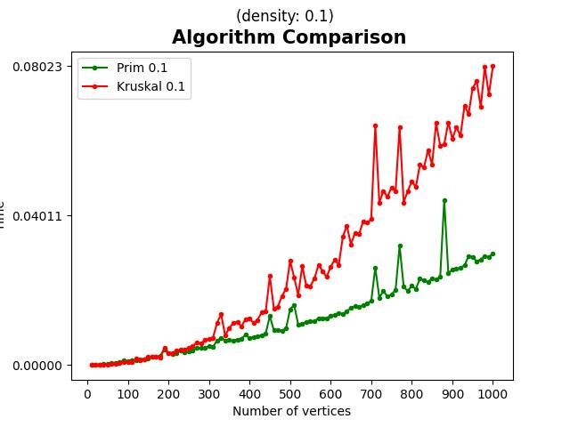
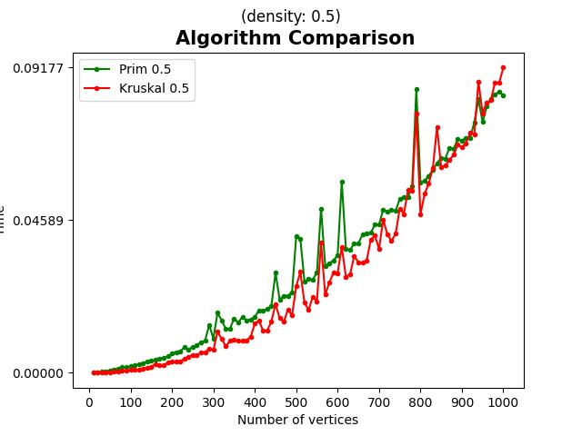
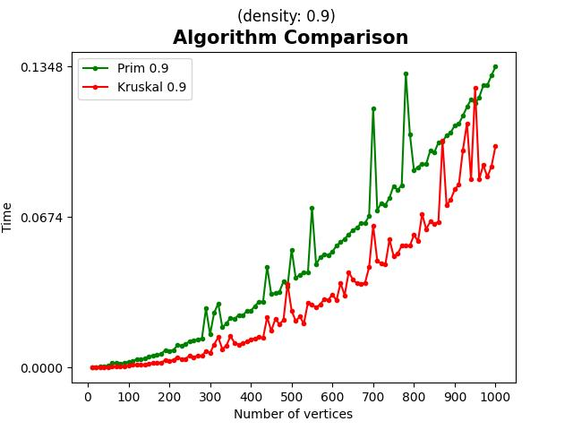
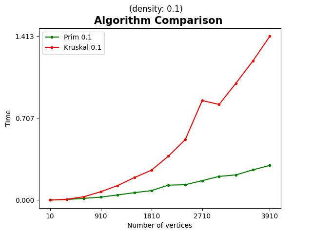
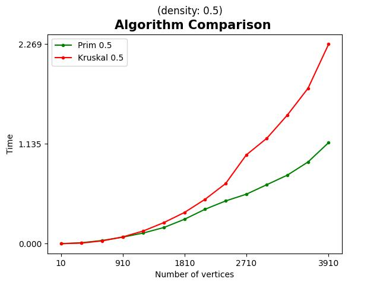
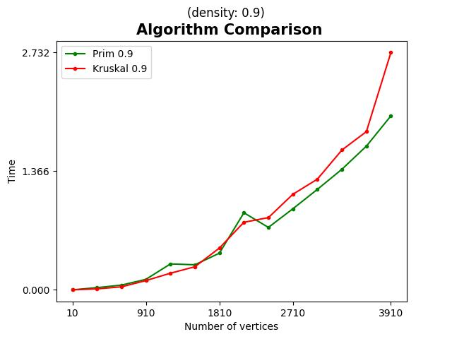

# Minimum spanning tree algorithms comparison
### Prim's and Kruskal's algorithms comparison.
Aim of this lab is to compare the efficiency of the Prim and Kruskal algorithm. And find out how do they behaive in different scenarios
### Prim's algorithm
```python
while not Q.empty():
        temp = Q.get()
        edge_len = temp[0]
        edge = temp[1]
        if U[edge]:
            continue
        S += edge_len
        U[edge] = True
        for i in range(len(Graph[edge])):
            cost = Graph[edge][i][1]
            v = Graph[edge][i][0]
            if not U[v] and dist[v] > cost:
                Q.put((cost, v))
                dist[v] = cost
```

### Kruskal's algorithm
```python
sum = 0
    while 1:
        break_1 = False
        for elem in graph:
            break_1 = False
            if len(vertices) == 1:
                return sum
            for n1, vert1 in enumerate(vertices):
                if elem[0] in vert1 and not break_1:
                    for n2, vert2 in enumerate(vertices):
                        if elem[1] in vert2 and vert2 != vert1:
                            vertices.pop(min(n2, n1))
                            vertices.pop(max(n2, n1)-1)
                            vertices.append(vert1.union(vert2))
                            sum += elem[2]
                            break_1 = True
                            break
```

### Testing
#### Hardware specs
**OS**: Windows 10 x64 \
**RAM**: 16GB \
**CPU**:
Model number: i7-9750H;
Frequency:	2600 MHz;
Maximum turbo frequency:	4500 MHz;
Low power frequency:	800 MHz;

Bus speed:	8 GT/s DMI;
Clock multiplier:	26;
Package:	1440-ball Flip-Chip Ball Grid Array;
Socket:	BGA1440;
Manufacturing process:	0.014 micron;
Data width:	64 bit;
The number of CPU cores:	6;
The number of threads:	12;
Level 1 cache size:	6 x 32 KB 8-way set associative instruction caches
6 x 32 KB 8-way set associative data caches;
Level 2 cache size:	6 x 256 KB 4-way set associative caches;
Level 3 cache size:	12 MB 16-way set associative shared cache;
Multiprocessing:	Uniprocessor.
#### How the testing was done
Algorithms were tested on three different scenarios. 
 - 1-st: density 0.1 and number of vertices goes from 10 to 1000
 - 2-nd: density 0.5 and number of vertices goes from 10 to 1000
 - 3-rd: density 0.9 and number of vertices goes from 10 to 1000
Results were saved to a file called [results.csv](results.csv)
#### Plots



Bigger number of vertices



### Results
We can see some unpredictable results at the graphs with bigger density.
### Contributors
* Maksym Mykhasiuta
* Bohdan Pelekh
